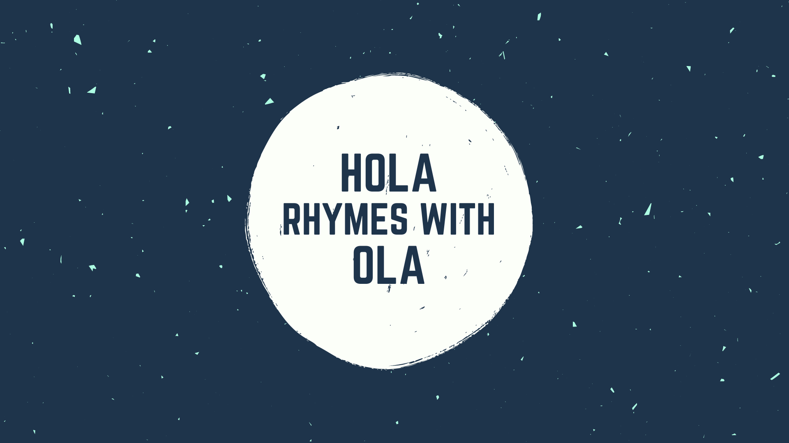

<h1 align="center">Hola, 👋 I'm Ola(mide)</h1>

## About Me

I'm an aspiring fullstack web developer that builds awesome web apps using the MERN Stack and blog about what I learn as a hobby.

  

  
  
  
  
  
  

I also play with WordPress in my freetime and do some UI/UX Design too.

----

## 🔭 I'm currently working on.

A Browser Based Real-time Strategy Game using Vanilla JS, HTML and CSS

## 🌱 I’m currently learning.
### Some JS Algorithms:
Adding to my Javascript Knowledge and Practicing algorithms and data structures.

## 👯 I’m looking to collaborate on ...

Awesome Open source Web based applications and games.

## 🤔 I’m looking for help with ...

NodeJS and ExpressJS

## 💬 Ask me about ...

Vanilla JS, HTML, Bootstrap, CSS, Sass and WordPress.

## 📫 Catch me on: ...

-----

